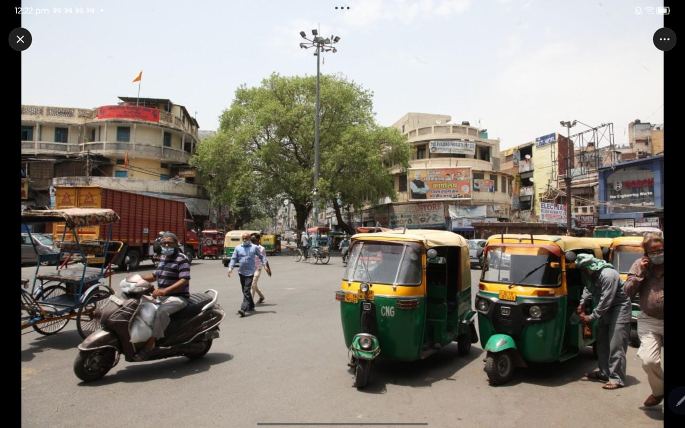
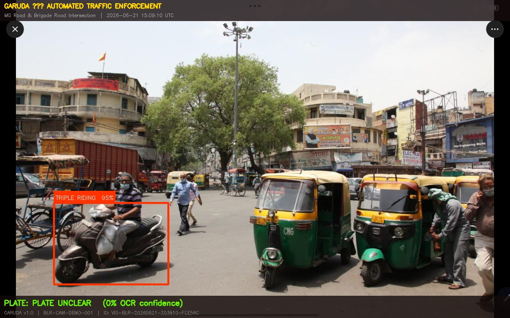
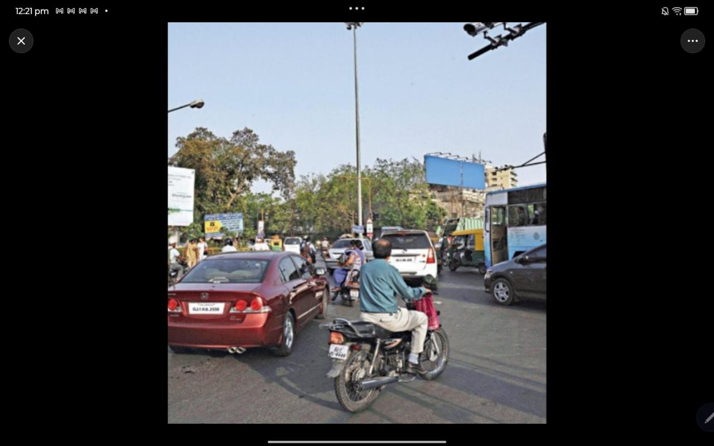
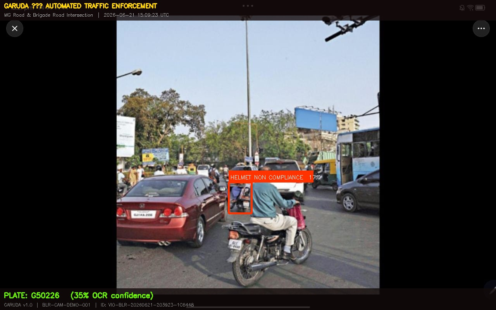
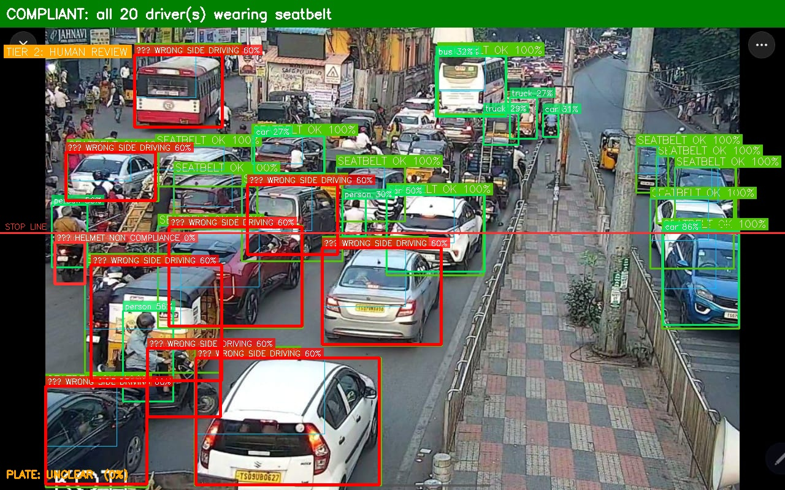

# GARUDA — Backend Reference Guide
**For frontend developers and integration partners**
*(Pitch name: "Gridlock Guardian" — Flipkart Gridlock 3.0. Code/API/DB still use "GARUDA" internally.)*

---

## What is GARUDA?

GARUDA is an **edge-native, automated traffic violation detection system** designed to run efficiently on low-power devices while maintaining production-grade accuracy. It processes live camera streams or batch video uploads through an advanced multi-stage pipeline, extracts license plates, routes citations based on confidence scores, and exposes an interactive dashboard and AI copilot for law enforcement officers.

---

## 🚀 Unique Selling Propositions (USPs)

### 1. Local Gemma-3 AI Copilot & Platform Agent
*   **What it is**: A fully integrated conversational AI partner powered by a local **`gemma3:1b`** LLM running via Ollama.
*   **Key Capabilities**:
    *   **Natural Language Database Operations**: Operators can ask *"Show me the last 5 pending wrong-way citations"* or *"Inspect the history of vehicle MH-12-AB-1234"*, and the agent translates this into safe SQLAlchemy queries.
    *   **Platform Commands & Navigation**: The agent can navigate the frontend UI for the user (e.g., *"Open the review queue"* triggers a page redirect to `/review`) or toggle RTSP streams online/offline.
    *   **Safety Guardrails**: Implements a keyword blocking matrix preventing destructive operations (e.g., `DROP`, `DELETE`, `TRUNCATE`) to preserve database integrity.
*   **Code Location**: [backend/core/agent_executor.py](file:///d:/vignesh/files/Personal/Hackthon/flipkart_Gridlock2/GARUDA/backend/core/agent_executor.py) & [backend/api/agent.py](file:///d:/vignesh/files/Personal/Hackthon/flipkart_Gridlock2/GARUDA/backend/api/agent.py)

### 2. Edge-Native Optimization (Raspberry Pi 5 Ready)
*   **What it is**: Architectural constraints designed to run the full pipeline on a **Raspberry Pi 5** or edge gateway without requiring massive server GPUs.
*   **Key Capabilities**:
    *   **CPU Thread-Pool Execution**: Inference tasks and video rendering run on background threads using an asynchronous loop executor to prevent event-loop blockages.
    *   **Heuristic Fallback Cascade**: If GPU weights (`helmet_best.pt` or `traffic_lights_yolov8x.pt`) are missing or disabled, the pipeline automatically cascades to rule-based fallback logic (e.g., HSV-based color signal tracking, and edge-density/color-variance crop classifiers) to save compute cycles.
    *   **Variable Frame Sampling**: Adapts analysis rate (e.g., sampling streams at 1fps or 6fps) to fit within low-power thermal and CPU budgets.
*   **Code Location**: [ml/pipeline/violation_classifier.py](file:///d:/vignesh/files/Personal/Hackthon/flipkart_Gridlock2/GARUDA/ml/pipeline/violation_classifier.py) & [backend/api/stream.py](file:///d:/vignesh/files/Personal/Hackthon/flipkart_Gridlock2/GARUDA/backend/api/stream.py)

### 3. 2-Stage License Plate Extraction & Multi-Engine OCR
*   **What it is**: High-accuracy registration detection designed for messy, real-world roads.
*   **Key Capabilities**:
    *   **Stage-1 Plate Extraction**: Identifies candidate plates across wide fields of view using `plate_koushi.pt`.
    *   **Stage-2 Crop Refinement**: Runs a secondary classifier (`plate_yasir.pt`) to confirm the crop is a valid plate before spawning OCR, filtering out bumper stickers, signs, and background noise.
    *   **OCR Engine Fallback Chain**: Tries high-speed local inference engines sequentially (`fast-plate-ocr` ➔ `PaddleOCR` ➔ `EasyOCR` ➔ `Tesseract`) to guarantee readable outputs under diverse angles and contrast.
*   **Code Location**: [ml/pipeline/ocr.py](file:///d:/vignesh/files/Personal/Hackthon/flipkart_Gridlock2/GARUDA/ml/pipeline/ocr.py)

---

## 🎥 Live Demo Evidence — Real Indian Traffic, Real Results

> **All footage below is uncut, unedited output from the GARUDA pipeline running on real Indian traffic footage.**
> Bounding boxes, labels, confidence scores, plate OCR, tier routing, and stationary timers are all drawn by the system — zero post-processing.

---

### Demo 1 — Helmet Non-Compliance + Triple Riding + Seatbelt (Multi-Violation Scene)

The pipeline simultaneously flags **helmet non-compliance**, **triple riding**, and runs **seatbelt checks** across all cars in the same frame. Every vehicle gets a detection pass — compliant ones get green boxes, violations get red.

````carousel


<!-- slide -->


````

| Stream | What you're seeing |
|--------|--------------------|
| **Annotated** (`_annotated.mp4`) | Evidence-only view — violations surfaced with violation type, confidence %, plate OCR, and tier routing decision |
| **Demo/QA** (`_demo.mp4`) | Every tracked vehicle + person; green = compliant, red = violation; "Stationary: Xs" counter on stopped vehicles |

---

### Demo 2 — Wrong-Way Driving + Illegal Parking (Tracker-Based, Video-Only Checks)

Wrong-way and illegal parking are **tracker-dependent** — they only fire on video with ByteTrack IDs. The pipeline tracks heading angle (>100° off legal direction for 2+ consecutive frames) and stationary duration (30s frame-counter threshold, not wall-clock time).

````carousel


<!-- slide -->


````

---

### Demo 3 — Full Pipeline Output (Annotated Result Videos)

End-to-end render of the batch job path (`POST /jobs/upload` → background task → two MP4 outputs written). The same `_render_frame_full()` function runs for both WebSocket render and REST job upload — one shared pipeline, two output streams.

````carousel


<!-- slide -->


<!-- slide -->


<!-- slide -->


````

---

### Static Frame Evidence — Input vs. Output Side-by-Side

Real Indian traffic still-frame results. Each pair shows the **raw camera input** alongside the **GARUDA-annotated output** with bounding boxes, labels, confidence scores, and violation IDs baked in.

````carousel
**Scene 1 — Triple Riding Detected (MG Road Intersection, Bangalore)**
*Raw Input → GARUDA Output: three riders on one scooter flagged at 95% confidence. Plate unclear (occluded), violation ID `VIO-BLR-20260621-203910-FCE56C` generated.*



<!-- slide -->



<!-- slide -->

**Scene 2 — Helmet Non-Compliance Detected (Bangalore Traffic, Rear Angle)**
*Raw Input → GARUDA Output: motorcycle rider without helmet flagged. Partial plate `G50226` read at 35% OCR confidence — low angle, motion blur, partial plate coverage. Tier-2 human review routed.*



<!-- slide -->



<!-- slide -->

**Scene 3 — Dense Traffic Multi-Detection: Seatbelt + Wrong-Way + Stop-Line (20+ vehicles)**
*Single frame, 20+ tracked vehicles. Seatbelt OK (green) across all visible car windshields. Multiple wrong-way candidates flagged for human review (orange "???"). Stop-line zone visible. This is the exact frame type the pipeline processes in real-time via the patrol WebSocket.*


````

---

### Model Performance at a Glance

| Dataset | Images | Helmet mAP@0.5 | No-Helmet mAP@0.5 | Overall mAP@0.5 |
|---------|--------|----------------|-------------------|-----------------|
| **Indian Traffic** (training domain) | 12,632 | — | — | **0.842** ✅ |
| **Foreign Dataset** (zero-shot OOD) | 764 | 0.7227 | 0.3627 | **0.5427** |

> **Why the gap?** Indian traffic has distinct helmet shapes (full-face + half-face mixes), head coverings (dupattas, scarves), and camera angles (overhead CCTV) not represented in foreign datasets. The model was trained and validated specifically on Indian road conditions — zero-shot transfer to foreign data is expected to degrade. The 0.842 on Indian traffic is what matters for deployment.

---

## 📋 Problem Statement Walkthrough & Code Traceability

Below is the traceability matrix mapping requirements from the Flipkart Gridlock problem statement (`ps.txt`) directly to their corresponding implementations in the codebase:

| ps.txt Requirement | Status | Feature & Implementation Details | Codebase Reference (File Scheme) |
| :--- | :---: | :--- | :--- |
| **Image Preprocessing** | ✅ | Adjusts contrast (CLAHE), applies bilateral filtering for denoising (rain, shadow, blur), and applies gamma/exposure correction. | [ml/pipeline/preprocessor.py](file:///d:/vignesh/files/Personal/Hackthon/flipkart_Gridlock2/GARUDA/ml/pipeline/preprocessor.py) |
| **Vehicle & User Detection** | ✅ | Runs fine-tuned YOLOv8m models to localize vehicles (cars, bikes, trucks, buses) and road users (pedestrians, riders). | [ml/pipeline/detector.py](file:///d:/vignesh/files/Personal/Hackthon/flipkart_Gridlock2/GARUDA/ml/pipeline/detector.py) |
| **Helmet Non-compliance** | ✅ | Identifies bare heads vs. helmets using full-frame detector `helmet_best.pt` with fallback to binary head-crop CNN. | [ml/pipeline/violation_classifier.py#L797](file:///d:/vignesh/files/Personal/Hackthon/flipkart_Gridlock2/GARUDA/ml/pipeline/violation_classifier.py#L797) |
| **Seatbelt Non-compliance** | ✅ | Windshield-ROI detection using YOLOv11s classifier model (`seatbelt_classifier.pt`). | [ml/pipeline/violation_classifier.py#L933](file:///d:/vignesh/files/Personal/Hackthon/flipkart_Gridlock2/GARUDA/ml/pipeline/violation_classifier.py#L933) |
| **Triple Riding** | ✅ | Measures spatial clustering overlaps between riders (person boxes) and two-wheeler bboxes. | [ml/pipeline/violation_classifier.py#L1017](file:///d:/vignesh/files/Personal/Hackthon/flipkart_Gridlock2/GARUDA/ml/pipeline/violation_classifier.py#L1017) |
| **Wrong-side Driving** | ✅ | Multi-frame velocity vector direction checking against calibrated zones with heading thresholds. | [ml/pipeline/violation_classifier.py#L1047](file:///d:/vignesh/files/Personal/Hackthon/flipkart_Gridlock2/GARUDA/ml/pipeline/violation_classifier.py#L1047) |
| **Stop-line Violation** | ✅ | Crosses vehicle bboxes against stop-line coordinates while gating for active red-signal state. | [ml/pipeline/violation_classifier.py#L1110](file:///d:/vignesh/files/Personal/Hackthon/flipkart_Gridlock2/GARUDA/ml/pipeline/violation_classifier.py#L1110) |
| **Red-light Violation** | ✅ | Debounced transition check confirming a vehicle crossed from a legal zone to illegal zone during a red light. | [ml/pipeline/violation_classifier.py#L1143](file:///d:/vignesh/files/Personal/Hackthon/flipkart_Gridlock2/GARUDA/ml/pipeline/violation_classifier.py#L1143) |
| **Illegal Parking** | ✅ | Monitors track IDs remaining stationary inside calibrated parking zones for more than 30s (anchored to video FPS). | [ml/pipeline/violation_classifier.py#L1176](file:///d:/vignesh/files/Personal/Hackthon/flipkart_Gridlock2/GARUDA/ml/pipeline/violation_classifier.py#L1176) |
| **Confidence Scoring** | ✅ | Assigns confidence values and routes via `ConfidenceRouter` (Auto-Challan vs. Review Queue vs. Log/Discard). | [ml/pipeline/confidence_router.py](file:///d:/vignesh/files/Personal/Hackthon/flipkart_Gridlock2/GARUDA/ml/pipeline/confidence_router.py) |
| **License Plate Recognition** | ✅ | Stage-1 plate detection (`plate_koushi.pt`) + Stage-2 refinement (`plate_yasir.pt`) + fast-plate-ocr fallback chain. | [ml/pipeline/ocr.py](file:///d:/vignesh/files/Personal/Hackthon/flipkart_Gridlock2/GARUDA/ml/pipeline/ocr.py) |
| **Evidence Generation** | ✅ | Packages annotated visual layouts (highlighting violation region and zoomed-in plate) with full JSON metadata. | [ml/utils/evidence.py](file:///d:/vignesh/files/Personal/Hackthon/flipkart_Gridlock2/GARUDA/ml/utils/evidence.py) & [ml/utils/visualizer.py](file:///d:/vignesh/files/Personal/Hackthon/flipkart_Gridlock2/GARUDA/ml/utils/visualizer.py) |
| **Analytics & Reporting** | ✅ | Centralized SQLite database stores logs, camera configs, audit logs, and repeat offenders. Exposes endpoints for stats. | [backend/api/analytics.py](file:///d:/vignesh/files/Personal/Hackthon/flipkart_Gridlock2/GARUDA/backend/api/analytics.py) |
| **Performance Evaluation** | ✅ | Local scripts validate model files against external datasets and generate precision/recall reports. | [scratch/eval_helmet_best.py](file:///d:/vignesh/files/Personal/Hackthon/flipkart_Gridlock2/GARUDA/scratch/eval_helmet_best.py) |

---

## Status as of 2026-06-22 (post-refactor)

- **Backend**: all endpoints below are real and working against a live SQLite DB — not mocked. 13 routers, 2 WebSocket endpoints, auth + RBAC, an audit trail, and a local LLM ops agent are all wired into `backend/main.py`.
- **ML models**: 7 trained weight files are loaded and used in the live pipeline (not placeholders) — see the model table below. Numbers are reported only where a real metrics file or training run actually exists; models without one are marked as having no published/measured benchmark rather than given an invented figure.
- **Live data path**: `POST /api/v1/jobs/upload` runs the real ML pipeline (preprocess → detect → classify → OCR) in a background task and writes violations straight to the DB. `python ml/demo_pipeline.py --input <image> --backend-url http://localhost:8000` is the CLI equivalent, useful for local debugging. `/debug/inject-violation` still exists for pure UI testing with fake data — don't confuse its output with real detections.
- **Not implemented**: cross-camera vehicle re-identification; federated learning is wired (`ml/federated/`) but doesn't retrain from real edge data yet. (Note: An automated validation harness `scratch/eval_helmet_best.py` has now been successfully implemented to evaluate the primary helmet model on external test sets).
- **2026-06-22 architectural refactor**:
  - Extracted `cameras`, `vehicles`, `analytics`, `stream`, and `debug` from the 707-line `_routers.py` god-file into their own standalone routers.
  - Created `backend/services/` layer with three reusable services: `MLRegistry` (shared model singleton), `CalibrationService` (camera calibration), `ChallanService` (violation packaging + tier routing).
  - Eliminated the duplicate-ML-singleton bug — both `jobs.py` and `stream.py`'s patrol WebSocket now share one `MLRegistry` instance loaded via `get_ml_registry()`.
  - Reorganised `ml/models/weights/` into `detection/`, `violations/`, `ocr/`, `metrics/` subdirectories.
  - All weight paths updated in `detector.py`, `ocr.py`, and `violation_classifier.py`.
- **2026-06-23 violation-logic audit** (found by testing against real video, not just unit tests — see `ml/pipeline/violation_classifier.py`):
  - `check_red_light()` required only that the vehicle be *anywhere* past the stop line in the recent window, not that it actually crossed — a vehicle already parked past the line before the light turned red was wrongly classified as running it. Now requires evidence the vehicle was on the legal side earlier in the same window.
  - `check_illegal_parking()`'s 5-minute timer used `time.monotonic()` (wall-clock processing time), which has nothing to do with video time for batch/offline jobs. Now anchored to a frame counter scaled by `self.fps`. Threshold subsequently lowered to 30s (intentionally aggressive — short stationary spells should surface for review, not auto-confirm) and routed to Tier-2 human review (confidence 0.75) instead of auto-challan.
  - `check_wrong_side()` used a raw velocity dot-product threshold, which a vehicle merely turning or changing lanes could trip. Now uses a heading-angle threshold (`WRONG_SIDE_ANGLE_THRESHOLD_DEG = 100`) plus a 2-consecutive-frame persistence counter (`WRONG_SIDE_STRIKES_REQUIRED`) before confirming.
  - `check_stop_line()` had no confidence floor on the signal reading at all (unlike `check_red_light()`'s 0.60 floor) — a marginal ~0.4-0.5-confidence signal misdetection (e.g. a stray red taillight/sign) was enough to cite a stopped vehicle with no real traffic light nearby. Added the same 0.60 floor to both the tracked and static-fallback versions.
  - The signal-state debounce buffer (`_smooth_signal_state`) could be dominated by a single isolated false-positive detection (frames with no light detected never entered the buffer, so one stray reading was 100% of it) and never went stale, so two false detections minutes apart could "agree" with each other. Now requires ≥2 agreeing samples and discards the buffer after a detection gap longer than the smoothing window.
  - `AIHelmetViolationDetector.detect()`'s crop-based fallback derived the head region from the **motorcycle's own bbox**, which is frequently tight around just the bike + lower body and excludes an upright rider's head entirely — confirmed visually on real footage where the crop captured the rider's torso, not their head. Now prefers the bbox of the rider's already-associated person detection (`associate_riders_with_vehicles()`), which reliably includes the head. Also added a confidence floor on `helmet` (compliant) detections symmetric to the existing one on `head` (no-helmet) detections — a single 0.19-confidence "wearing helmet" read was previously enough to silently clear an actually bare-headed rider.
  - **Known residual limitation, not fixed by the above**: even with the corrected head crop, the trained helmet CNN (`helmet_cnn.pt`) can still confidently (>0.99) misclassify a bare head as helmeted on very small/blurry/distant crops — that's a model-accuracy limitation requiring retraining, not a logic bug. Likewise, ByteTrack's track-ID continuity is unreliable in heavily congested/occluded scenes (observed both as a parking-timer reset and as a wrong-side velocity sign flip on the same physical vehicle) — calibrating tight zones helps, but isn't a complete fix.

---

## Quick Start

```bash
# 1. Install dependencies
pip install -r requirements.txt

# 2. Copy and fill env
cp .env.example .env

# 3. Start backend
uvicorn backend.main:app --reload --port 8000

# 4. Open Swagger docs
open http://localhost:8000/docs

# 5. Open frontend dashboard
open frontend/index.html

# 6. Feed it real ML detections via the job queue (recommended):
curl -F "name=test" -F "source_type=Image" -F "file=@test/sample.jpg" \
     http://localhost:8000/api/v1/jobs/upload

# 6b. Or via the standalone CLI pipeline:
python ml/demo_pipeline.py --input sample.jpg --backend-url http://localhost:8000
```

---

## System Architecture

```
Image / Video / Camera Feed
    ↓
[Preprocessor]   ml/pipeline/preprocessor.py — CLAHE + denoise + gamma correction
    ↓
[Detector]       ml/pipeline/detector.py — YOLOv8m (yolov8m.pt) → vehicles, persons, phones
    ↓
[Tracker]        ml/pipeline/tracker.py — ByteTrack (video only) → persistent track IDs, velocity, history
    ↓
[Violation Classifier]   ml/pipeline/violation_classifier.py — 9 violation types (see table below)
    │   ├─ Helmet:   AICity 9-class detector (helmet_best.pt) on full image, falls back to
    │   │            crop CNN (helmet_cnn.pt) or edge/colour heuristic. Reports the model's
    │   │            real per-box confidence (fixed 2026-06-21 — was a hardcoded 0.50 stub).
    │   │            Used ONLY for helmet — does not feed triple-riding. The crop-based
    │   │            fallback's head region now comes from the rider's own person bbox, not
    │   │            the motorcycle's bbox (fixed 2026-06-23 — a motorcycle's bbox frequently
    │   │            excludes an upright rider's head entirely, silently breaking the crop).
    │   ├─ Triple riding: fully independent of the helmet model. Person + motorbike
    │   │            detections from the main YOLOv8m detector are grouped by IoU/position
    │   │            via associate_riders_with_vehicles() (nearest-rider-first, capped at
    │   │            4/vehicle, each person assigned to at most one vehicle per frame) —
    │   │            ported from temp/AI_Traffic_Violation_Detection_triple_riding_detection's
    │   │            group_riders_with_vehicles()
    │   ├─ Seatbelt: windshield-ROI YOLOv11s classifier (seatbelt_classifier.pt), Hough-line
    │   │            fallback if weights missing
    │   ├─ Signal:   traffic_lights_yolov8x.pt, falls back to HSV colour heuristic.
    │   │            Readings are majority-vote smoothed over the last 5 frames before
    │   │            being trusted (fixed 2026-06-23 — a single isolated false-positive
    │   │            detection used to be enough to confirm a colour change outright)
    │   └─ Wrong-side / stop-line / red-light / illegal-parking: tracker-based when video
    │       tracking state exists; static-position fallback when only a single image
    │       exists. Stop-line and red-light fallbacks gate on signal-detection
    │       confidence (both now floored at 0.60 — fixed 2026-06-23, stop-line previously
    │       had no floor at all); wrong-side fallback is a position-only proxy (no heading
    │       signal in a still frame) against a per-camera `wrong_side_lane` setting,
    │       not a universal rule — calibrate it like `stop_line_y`. The tracked red-light
    │       check now requires an actual crossing (legal-side-then-violating-side), not
    │       mere presence past the line; the tracked wrong-side check now uses a heading-
    │       angle threshold + 2-frame persistence instead of a raw velocity dot product;
    │       illegal-parking's duration timer is anchored to a frame counter instead of
    │       wall-clock time (all fixed 2026-06-23 — see Status section above)
    ↓
[Driver State]   ml/pipeline/driver_state.py — MediaPipe FaceMesh → drowsiness, yawn, phone-in-hand
    ↓
[OCR]            ml/pipeline/ocr.py — 2-stage plate detection (Koushi → YasirFaiz) +
    │            text engine fallback chain: fast-plate-ocr → PaddleOCR → EasyOCR → Tesseract
    ↓
[Confidence Router]  ml/pipeline/confidence_router.py — 3-tier routing decision
    ↓
┌─────────────────────┐
│  TIER 1 (conf≥0.90) │ → AUTO_CHALLAN (saved to DB, no human needed)
│  TIER 2 (conf≥0.60) │ → HUMAN_REVIEW (WhatsApp alert to officer)
│  TIER 3 (conf<0.60) │ → LOG_WITH_PLATE / DISCARD
└─────────────────────┘
    ↓
[Evidence Packager]  ml/utils/evidence.py — annotated JPEG + JSON record
    ↓
[FastAPI Backend]    backend/main.py — REST API + WebSocket + SQLite
    ↓
[Frontend Dashboard]
```

Two entry points run this pipeline today:
1. **`backend/api/jobs.py`** — uses `get_ml_registry()` from `backend/services/ml_registry.py` (shared singleton), used by `POST /jobs` and `POST /jobs/upload`. This is the path the dashboard's upload flow hits.
2. **`ml/demo_pipeline.py`** — standalone CLI for local testing/debugging, optionally POSTs results to the backend via `--backend-url`.

The patrol WebSocket (`backend/api/stream.py → ws_patrol`) also shares the same `MLRegistry` singleton — no separate model instances are loaded.

---

## Backend Directory Structure (post-refactor)

```
backend/
├── main.py                       FastAPI app — CORS, lifespan, router registration
├── core/
│   ├── config.py                 Settings (DATABASE_URL, SECRET_KEY, SMTP creds)
│   ├── database.py               ORM models, async engine, CRUD helpers
│   ├── auth_utils.py             JWT creation, password hashing, RBAC
│   ├── email_service.py          SMTP email dispatch
│   └── agent_executor.py         Gemma-2 local LLM ops-agent
├── models/
│   └── schemas.py                Pydantic request/response schemas
├── services/                     ← NEW business-logic layer
│   ├── ml_registry.py            Shared ML singleton (preprocessor, detector, OCR, classifier)
│   ├── calibration_service.py    Per-camera calibration resolver (stop_line_y, zones, direction)
│   └── challan_service.py        Violation packaging, tier routing, DB persistence
└── api/
    ├── cameras.py                CRUD for camera registry + calibration config
    ├── vehicles.py               Vehicle lookup + repeat-offender list
    ├── analytics.py              Summary, trends, heatmap endpoints
    ├── stream.py                 /ws/feed (dashboard) + /ws/patrol (mobile)
    ├── debug.py                  Inject test violation, pipeline status, ML registry health
    ├── jobs.py                   Job queue — upload, process, status, results
    ├── violations.py             Ingest + list violations
    ├── reviews.py                Officer review workflow
    ├── evidence.py               Evidence image serving
    ├── auth.py                   Login, token refresh, registration
    ├── users.py                  User management
    ├── audit_logs.py             Audit trail
    └── agent.py                  AI ops-agent chat endpoint
```

## ML Directory Structure (post-refactor)

```
ml/
├── pipeline/                     Inference modules (unchanged)
│   ├── preprocessor.py           CLAHE + denoise + gamma
│   ├── detector.py               YOLOv8m vehicle/person/phone detector
│   ├── tracker.py                ByteTrack per-camera state
│   ├── violation_classifier.py   9 violation types — all sub-classifiers here
│   ├── confidence_router.py      3-tier routing thresholds
│   ├── driver_state.py           MediaPipe FaceMesh drowsiness/phone
│   └── ocr.py                    2-stage plate detection + OCR engine fallback chain
├── models/
│   ├── helmet_cnn.py             CNN architecture definition
│   └── weights/
│       ├── detection/            Primary detector weights
│       │   └── yolov8m.pt
│       ├── violations/           Per-violation-type weights
│       │   ├── helmet_best.pt
│       │   ├── helmet_cnn.pt
│       │   ├── seatbelt_classifier.pt
│       │   └── traffic_lights_yolov8x.pt
│       ├── ocr/                  Plate detector weights
│       │   ├── plate_koushi.pt
│       │   ├── plate_yasir.pt
│       │   └── plate_yolov8_moin.pt
│       └── metrics/              Training artefacts (not loaded at runtime)
│           ├── helmet_metrics.json
│           ├── plate_metrics.json
│           └── *.png             Training curves
├── federated/                    Federated learning client/server
├── training/                     Training scripts + data prep
└── utils/
    ├── evidence.py               Evidence packaging helper
    └── visualizer.py             Frame annotation renderer
```

---

## ML Model Inventory

### `ml/models/weights/detection/`

| File | Role | Loaded by |
|------|------|-----------|
| `yolov8m.pt` | Primary vehicle/person/phone detector | `ml/pipeline/detector.py` |

### `ml/models/weights/violations/`

| File | Role | Verified metrics | Loaded by |
|------|------|-------------------|-----------|
| `helmet_best.pt` | **Primary** helmet check — 9-class detector (helmet / head / person), runs on full image. Not used by triple-riding | **mAP@0.5 ≈ 0.842** (validated on **12,632** Indian traffic images). Zero-shot generalization tested on foreign dataset: **mAP@0.5 ≈ 0.543** (n=764) | `AIHelmetViolationDetector` in `violation_classifier.py` |
| `helmet_cnn.pt` | Fallback helmet classifier — binary CNN on head crop, trained in-house | accuracy=0.8744, precision=0.8675, recall=0.8182, **f1=0.8421** (n=215) | `HelmetClassifier` in `violation_classifier.py` |
| `seatbelt_classifier.pt` | Windshield-ROI seatbelt classifier (YOLOv11s-cls) | 100% top-1 validation accuracy at epoch 8 (early-stopped at 18/40 epochs) — **caveat**: validation split was only 129 images with just 8 negative (no-seatbelt) samples, so this number is not a reliable estimate of real-world performance on an imbalanced/out-of-distribution feed | `ViolationClassifier._load_seatbelt_model` |
| `traffic_lights_yolov8x.pt` | Traffic signal state detector (DTLD+LISA+BSTLD+HDTLR) | — | `MLSignalStateDetector` in `violation_classifier.py` |

### `ml/models/weights/ocr/`

| File | Role | Verified metrics | Loaded by |
|------|------|-------------------|-----------|
| `plate_koushi.pt` | Plate detector Stage-1 (best spatial coverage) | mAP50=0.8816, mAP50-95=0.5102 | `ml/pipeline/ocr.py` |
| `plate_yasir.pt` | Plate detector Stage-2 (confirms/refines Stage-1 crop) | — | `ml/pipeline/ocr.py` |
| `plate_yolov8_moin.pt` | Legacy fallback plate detector if Stage-1 missing | — | `ml/pipeline/ocr.py` (fallback chain) |

### `ml/models/weights/metrics/`
Training-time artefacts only — **not loaded at runtime**. Includes `helmet_metrics.json`, `plate_metrics.json`, and training curve PNGs.

OCR **text recognition** (separate from plate *detection*) tries engines in order: `fast-plate-ocr` → `PaddleOCR` → `EasyOCR` → `Tesseract`. See `ml/pipeline/ocr.py`.

---

## API Base URL

```
http://localhost:8000/api/v1
```

Interactive docs: `http://localhost:8000/docs`

---

## Authentication

JWT-based, implemented in `backend/api/auth.py`. Email verification is mandatory — `POST /auth/register` requires SMTP env vars to be set (`SMTP_HOST`, `SMTP_PORT`, `SMTP_USER`, `SMTP_PASSWORD`, `SMTP_FROM_EMAIL`) or registration fails with 400. Endpoints requiring `Depends(get_current_user)` (most of `users`, `audit_logs`, `agent`) need a Bearer token.

| Method | Endpoint | Description |
|--------|----------|--------------|
| POST | `/auth/register` | Create account, sends verification email |
| GET | `/auth/verify` | Email verification link target (returns HTML) |
| POST | `/auth/login` | Returns JWT |
| GET | `/auth/me` | Current user info |

---

## REST Endpoints

### Violations (`backend/api/violations.py`, no extra prefix — paths below are literal)

| Method | Endpoint | Description |
|--------|----------|--------------|
| GET | `/violations` | List violations (paginated, filterable) |
| GET | `/violations/{id}` | Get single violation with full JSON |
| POST | `/violations/ingest` | Submit new violation from ML pipeline |
| POST | `/violations/{id}/confirm` | Officer confirms → auto-challan |
| POST | `/violations/{id}/reject` | Officer rejects → false positive |
| GET | `/violations/{id}/image` | Redirect to annotated evidence image |
| POST | `/violations/public-report` | Public-facing citizen report submission |

#### List Violations — Query Params
| Param | Type | Description |
|-------|------|--------------|
| `page` | int | Page number (default 1) |
| `page_size` | int | Items per page (max 100, default 20) |
| `tier` | int | Filter by tier 1/2/3 |
| `status` | str | `pending` / `auto_challan` / `confirmed` / `rejected` |
| `camera_id` | str | Filter by camera |
| `type` | str | Violation type string |
| `date_from` / `date_to` | str | ISO date `YYYY-MM-DD` |

#### Violation Status Values
| Status | Meaning |
|--------|---------|
| `pending` | Tier 2 — awaiting officer action |
| `auto_challan` | Tier 1 — auto-issued, no review needed |
| `confirmed` | Officer confirmed, challan issued |
| `rejected` | Officer rejected (false positive) |
| `discarded` | Tier 3, too low confidence |

---

### Cameras (`/cameras`)

| Method | Endpoint | Description |
|--------|----------|--------------|
| GET | `/cameras` | List all registered cameras |
| POST | `/cameras` | Register a new camera |
| GET | `/cameras/{id}` | Get single camera info |
| PUT | `/cameras/{id}/config` | Update calibration (zones, direction, stop line) + RTSP config |
| DELETE | `/cameras/{id}` | Remove camera |

```json
// POST /cameras — Register Camera — Body (backend/models/schemas.py: CameraCreate)
{
  "id":          "BLR-CAM-MG-ROAD-001",
  "location":    "MG Road & Brigade Road Intersection",
  "lat":         12.9753,
  "lon":         77.6069,
  "stop_line_y": 380,
  "description": "4-lane junction, 30 km/h zone",
  "rtsp_url":    "",
  "resolution":  ""
}
```

```json
// PUT /cameras/{id}/config — Update Calibration — Body (CameraConfigUpdate, all fields optional)
{
  "stop_line_y":        420,
  "parking_zones":      [[80, 120, 350, 260], [900, 50, 1100, 200]],
  "traffic_direction":  "down",
  "wrong_side_zone":     [[1000, 300, 1900, 1300]],
  "description":        "Recalibrated after camera remount",
  "rtsp_url":           "rtsp://192.168.1.50/stream1",
  "resolution":         "1920x1080"
}
```

#### Calibration fields — what your frontend actually needs to send

**Coordinate system, the one thing to get right**: every `[x1,y1,x2,y2]` zone and `stop_line_y` are **raw pixel coordinates in the native resolution of that camera's source feed** — not normalized 0-1, not a fixed canvas size. `ImagePreprocessor.preprocess()` never resizes the frame (it downscales internally for enhancement, then upscales back to the original size before detection runs), so whatever resolution the uploaded video/RTSP stream actually is, that's the coordinate space the calibration UI must draw in. If your calibration tool lets someone draw a box on a *displayed* (possibly scaled-down) preview image, you must scale those coordinates back up to the source resolution before sending them — don't send canvas/display pixel coordinates as-is unless the preview is shown at 1:1.

| Field | Type | Default | Read by | What it does |
|-------|------|---------|---------|---------------|
| `stop_line_y` | `int` | `380` | `check_red_light()`, `check_stop_line()` (+ static fallbacks) | The y-pixel row of the stop line. A vehicle's bbox bottom edge (`bbox[3]`) past this row, while the light is red (running) or red/yellow (stopped on it), is what both checks test against. |
| `parking_zones` | `List[[x1,y1,x2,y2]]` | `[]` | `check_illegal_parking()`, `is_in_no_parking_zone()` | One or more no-parking rectangles. A vehicle's bbox *center* falling inside any of them, while stationary for ≥30s, fires `ILLEGAL_PARKING` (confidence 0.75, Tier-2 review). Empty list = check never fires for this camera. |
| `traffic_direction` | `"down"\|"up"\|"left"\|"right"` | `"down"` | `check_wrong_side()` | The legal direction of travel as this camera sees it, in image coordinates (`"down"` = vehicles should move toward increasing y / toward the bottom of frame). This is what a vehicle's heading is compared against. |
| `wrong_side_zone` | `List[[x1,y1,x2,y2]]` | `[]` | `check_wrong_side()`, `_check_wrong_side_static()` | One or more rectangles marking lanes reserved for traffic moving in `traffic_direction` only (e.g. the oncoming lane, or a one-way service lane). A vehicle inside one of these, heading more than 100° off `traffic_direction` for 2+ consecutive frames, fires `WRONG_SIDE_DRIVING`. Buses are exempt (legitimate bus-bay merges look like a sharp reversal but aren't a violation). Empty list = check never fires. |

**Fields that exist in code but are NOT wired to this API yet** — don't build calibration UI for these, they won't do anything via `/cameras`:
- `wrong_side_lane` (`"left"|"right"`) — a `ViolationClassifier` constructor default, only consumed by the image-only `_check_wrong_side_static()` fallback. No `CameraModel` column, no schema field, no way to set it per-camera today.
- `signal_bbox` (`[x1,y1,x2,y2]`, a calibrated ROI for where the traffic light itself is) — exists as a parameter throughout `MLSignalStateDetector`/`check_all()`, but no backend caller (`jobs.py`, `stream.py`) ever passes one. The signal detector always falls back to scanning the top 40% of the frame for every camera, calibrated or not.

**Practical calibration flow for a frontend**: show the operator a representative frame from that camera (e.g. a recent evidence image or a paused live frame) at its native resolution, let them drag a horizontal line for `stop_line_y` and rectangles for `parking_zones`/`wrong_side_zone`, pick `traffic_direction` from a 4-way compass selector, then `PUT` all of it to `/cameras/{id}/config` in one call — partial updates are fine, omitted fields are left unchanged.

---

### Vehicles (`/vehicles`)

| Method | Endpoint | Description |
|--------|----------|--------------|
| GET | `/vehicles/{plate}` | Vehicle history by plate |
| GET | `/vehicles/repeat` | All repeat offenders |
| DELETE | `/vehicles/{plate}/clear` | Admin: reset vehicle record |

---

### Analytics (`/analytics`)

| Method | Endpoint | Description |
|--------|----------|--------------|
| GET | `/analytics/summary` | Today + week totals, type breakdown |
| GET | `/analytics/trends?days=30` | Daily violation counts over N days |
| GET | `/analytics/heatmap` | Per-camera counts with lat/lon for Leaflet |

This is the closest thing to ps.txt's "Analytics and Reporting" requirement — it covers statistics/trends but is not a model-evaluation report (see gap note above).

---

### Jobs (`/jobs`) — the real ML ingestion path

| Method | Endpoint | Description |
|--------|----------|--------------|
| GET | `/jobs` | List all processing jobs |
| POST | `/jobs` | Create a metadata-only job, runs a stub background pipeline |
| POST | `/jobs/upload` | **Upload image/video** — runs the actual ML pipeline (preprocess→detect→classify→OCR) as a background task, writes results to `violations` table |
| GET | `/jobs/{job_id}` | Job status/progress |
| GET | `/jobs/{job_id}/violations` | Violations produced by a specific job |

---

### Reviews (`/reviews`) — officer review audit trail

| Method | Endpoint | Description |
|--------|----------|--------------|
| GET | `/reviews` | List review actions (filtered audit log entries: approved/rejected/escalated) |
| POST | `/reviews` | Submit officer decision on a Tier-2 violation; updates violation status and writes an audit log row |

---

### Evidence (`/evidence`)

| Method | Endpoint | Description |
|--------|----------|--------------|
| GET | `/evidence/{id}` | Before/violation/after frame metadata for a violation (used by the evidence-timeline UI) |
| GET | `/evidence/test-gallery/list` | List sample images in `test/` for demo purposes |
| GET | `/evidence/test-gallery/image/{filename}` | Serve a sample image (path-traversal guarded) |

---

### Users (`/users`) — requires auth

| Method | Endpoint | Description |
|--------|----------|--------------|
| GET | `/users` | List all platform users |
| PUT | `/users/{user_id}/role` | Change a user's role (Admin only) |

---

### Audit Logs (`/audit-logs`) — requires auth

| Method | Endpoint | Description |
|--------|----------|--------------|
| GET | `/audit-logs` | Full compliance/audit trail, newest first |

---

### Gemma AI Agent (`/agent`) — requires auth

| Method | Endpoint | Description |
|--------|----------|--------------|
| POST | `/agent/chat` | Natural-language ops queries against the DB via a local `gemma3:1b` model (Ollama) + guarded SQL tool calls |
| GET | `/agent/status` | Check whether Ollama and `gemma3:1b` are running/loaded |

---

### Debug Endpoints (`/debug`)

| Method | Endpoint | Description |
|--------|----------|--------------|
| POST | `/debug/inject-violation` | Create fake violation (for UI testing only — not real ML output) |
| GET | `/debug/pipeline-status` | Shows which ML modules are installed |

```json
// Inject Test — Body
{
  "violation_type": "helmet_non_compliance",
  "confidence": 0.75,
  "tier": 2,
  "plate": "KA-01-AB-1234",
  "camera_id": "BLR-CAM-DEMO-001",
  "location": "MG Road"
}
```

---

## WebSocket — Live Feed

```
ws://localhost:8000/ws/feed
```

```javascript
const ws = new WebSocket('ws://localhost:8000/ws/feed');
ws.onmessage = (evt) => {
  const data = JSON.parse(evt.data);
  if (data.event === 'violation_detected') {
    // data.violation_id, data.violation_type, data.confidence,
    // data.tier, data.plate, data.camera_id, data.location,
    // data.timestamp, data.severity, data.annotated_image_url
  }
};
```

### Event Types
| Event | When | Fields |
|-------|------|--------|
| `connected` | On connect | `message` |
| `violation_detected` | New violation | See above |
| `system_stats` | Every 10s | `fps`, `active_cameras`, `violations_today`, `tier1`, `tier2` |
| `pong` | Reply to `ping` | — |

Send `"ping"` (string) to keep connection alive.

There is a second WebSocket, `ws://localhost:8000/ws/patrol`, for mobile patrol units: it accepts base64-encoded frames, runs them through the ML pipeline in real time, and returns annotated results + saves evidence on detection.

There is a third WebSocket, `ws://localhost:8000/ws/video-render`, that renders a full annotated + demo MP4 from an uploaded video using the exact same per-frame pipeline as the batch job path (`_render_frame_full()` in `backend/api/stream.py`). It now writes two separate output files — `{id}_annotated.mp4` (violations only — the evidence view) and `{id}_demo.mp4` (every tracked detection, QA view) — with per-track plate-OCR caching (re-runs OCR only once a vehicle's bbox has grown ≥15% closer, otherwise reuses the best prior read) instead of running OCR fresh every frame. It computes plate OCR for every freshly-confirmed violation, but until 2026-06-23 only ever used that result for the DB record — the rendered video itself never drew the plate text on screen. Fixed: it now draws `PLATE: <text> (<conf>%)` under the vehicle's box via `FrameVisualizer.draw_plate_result()` whenever OCR actually returns non-empty text. Note this doesn't guarantee text appears often — plate OCR's hit rate on small/distant/motion-blurred plates (e.g. a two-wheeler's rear plate from an overhead traffic-cam angle) is genuinely low; an empty `formatted_text` is the OCR engine failing to read the plate, not the drawing code being broken.

Also added 2026-06-23: a live "Stationary: Xs" counter drawn under any tracked vehicle that's currently stationary, via `TrackState.stationary_since_frame`/`stationary_duration_frames()` in `ml/pipeline/tracker.py` — set the moment velocity drops below the stationary threshold, cleared the instant it moves again. It's independent of any no-parking-zone calibration (shows on any stopped vehicle, not just ones inside a configured zone) and is purely visual — it doesn't gate `check_illegal_parking()`, which keeps its own separate, zone-gated timer. Unconditional on the demo stream; only shown alongside an actual violation on the annotated stream, to keep that one evidence-only. **Inherits the same ByteTrack ID-instability limitation noted elsewhere**: if a track ID gets reassigned to a different physical vehicle mid-clip, the counter resets even though the original vehicle never moved — confirmed on real footage where a genuinely-parked car's counter climbed correctly for ~11s, then reset because ByteTrack handed its ID to a passing vehicle.

---

## Static Files — Evidence Images

```
GET /evidence/annotated/{violation_id}.jpg
GET /evidence/raw/{violation_id}_raw.jpg
```

Mounted via `StaticFiles` in `backend/main.py`. A second static mount, `/test-images`, serves the `test/` directory (sample images for demo/gallery use).

---

## ML Pipeline — Violation Types

All 9 types are defined in `ml/pipeline/violation_classifier.py:39-73`. The first 7 map directly to ps.txt's violation list; the last 2 (`phone_use_while_driving`, `drowsy_driving`) are GARUDA additions beyond the problem statement's minimum scope.

| Type | Fine (₹) | Severity | Detection method |
|------|----------|----------|-------------------|
| `helmet_non_compliance` | 1,000 | High | `check_helmet()` — AICity 9-class detector on full image (primary), CNN crop or heuristic fallback. Confidence is the model's real per-box score (`AIHelmetViolationDetector.detect()`) — previously hardcoded to 0.50, fixed 2026-06-21. Crop-based fallback's head region now sourced from the rider's person bbox instead of the motorcycle's bbox, and a `head` (no-helmet) read needs ≥0.40 confidence symmetric to a `helmet` (compliant) read needing the same — previously a low-confidence "helmet" read could silently override an actual bare head (both fixed 2026-06-23). **Residual limitation**: the trained CNN itself can still confidently misclassify a bare head as helmeted on very small/blurry/distant crops — a model-accuracy issue, not something fixable in this layer |
| `seatbelt_non_compliance` | 1,000 | Medium | `check_seatbelt()` — YOLOv11s on windshield ROI, Hough-line fallback. Skips vehicles whose bbox exceeds 35% of frame area (added 2026-06-21 — oversized/frame-filling boxes like a close-up truck have no real windshield in that crop and were producing overconfident false positives) |
| `triple_riding` | 2,000 | High | `check_triple_riding()` — **independent of the helmet model** (decoupled 2026-06-21). Uses person + motorbike detections straight from the main YOLOv8m detector, grouped via `associate_riders_with_vehicles()`: IoU + position heuristic ported from `temp/AI_Traffic_Violation_Detection_triple_riding_detection`'s `group_riders_with_vehicles()` — nearest-rider-first, capped at 4/vehicle, persons assigned to at most one vehicle per frame. Computed once per frame in `check_all()` and shared across all two-wheelers |
| `wrong_side_driving` | 5,000 | Critical | Tracker: `check_wrong_side()` — heading-angle threshold (`WRONG_SIDE_ANGLE_THRESHOLD_DEG = 100`) against the calibrated `traffic_direction`, plus a 2-consecutive-frame persistence counter (`WRONG_SIDE_STRIKES_REQUIRED`) before confirming (fixed 2026-06-23 — previously a raw velocity dot-product threshold, which a vehicle merely turning or changing lanes could trip on a single noisy frame). Buses are exempt (`WRONG_SIDE_EXEMPT_CLASSES`, added 2026-06-23) — a legitimate bus-bay merge can momentarily point well "backward" relative to through-traffic and was false-positiving. Image-only: `_check_wrong_side_static()` — position-only proxy (no heading in a still frame) against the per-camera `wrong_side_lane` setting ("left"/"right", default "left"); only fires at moderate conf (0.60), treat as Tier-2 review material, not auto-challan |
| `stop_line_violation` | 500 | Medium | Tracker: `check_stop_line()` over N-frame history, now gated on `signal_conf >= 0.60` (fixed 2026-06-23 — previously had **no** confidence floor at all, so a ~0.4-0.5-confidence signal misdetection, e.g. a stray red taillight, was enough to cite a vehicle with no real traffic light nearby). Image-only: `_check_stop_line_static()` — position vs. stop-line-y, same `signal_conf >= 0.60` floor |
| `red_light_violation` | 1,000 | High | Tracker: `check_red_light()` — now requires an actual crossing (vehicle was on the legal side earlier in the same window, not just present past the line at some point), gated on `signal_conf >= 0.60` (crossing requirement added 2026-06-23 — previously "anywhere past the line in the last N frames" wrongly classified an already-parked vehicle as having run the light once the signal turned red). Image-only: `_check_red_light_static()` — position + signal state, gated on `signal_conf >= 0.65` |
| `illegal_parking` | 500 | Low | Tracker: `check_illegal_parking()` — 30s stationary threshold (lowered from 300s 2026-06-23, deliberately aggressive) + zone check, confidence 0.75 (Tier-2 human review, not auto-challan — a 30s window is short enough that a brief traffic-queue stop could plausibly trip it, so it's routed for a human to confirm rather than auto-confirmed). Duration anchored to a frame counter (`self._frame_counter`) scaled by `self.fps` instead of `time.monotonic()` (fixed 2026-06-23 — wall-clock time has nothing to do with video time for batch/offline jobs, where frames can process faster or slower than real time). Image-only: `_check_illegal_parking_static()` zone-only (no timer) |
| `phone_use_while_driving` | 5,000 | High | `check_phone()` — COCO `cell_phone` class overlapping driver region |
| `drowsy_driving` | 2,000 | Critical | `ml/pipeline/driver_state.py` — MediaPipe FaceMesh eye/yawn analysis |

**Note**: wrong-side, stop-line, red-light, and illegal-parking checks were originally tracker-only (video). Image-only static fallbacks were added to `check_all()` so single-frame uploads through `/jobs/upload` still produce all 7 ps.txt-required violation types, not just helmet/seatbelt/triple-riding/phone.

**Known limitation (not yet fixed)**: ByteTrack's track-ID continuity is unreliable in heavily congested/occluded scenes — observed both as a single bad frame resetting `check_illegal_parking()`'s accumulated timer (an ID briefly reassigned to an unrelated vehicle) and as a sign flip in `check_wrong_side()`'s velocity for the same physical vehicle across an ID switch. Tight, carefully-bounded zone calibration reduces the blast radius but doesn't eliminate it.

**Fixed 2026-06-23**: `wrong_side_zone`/`parking_zones` are still axis-aligned rectangles only, and from an overhead camera at an oblique angle, two genuinely different lanes/paths (e.g. a bus's legitimate bus-bay merge vs. an adjacent scooter-only service lane) can sweep through the *same* rectangular screen region at different times — confirmed on a real clip where a `wrong_side_zone` drawn around the scooter lane also caught the bus's normal merge as a false "Wrong Way". Rather than chase a polygon-zone rewrite, `check_wrong_side()` now exempts buses outright (`WRONG_SIDE_EXEMPT_CLASSES`) — a bus pulling into/out of a marked stop routinely points well "backward" relative to through-traffic for several frames as a normal, legitimate maneuver, not a lane-discipline violation, for any camera angle, not just this one. Re-verified on the same clip: the bus no longer false-positives and the real wrong-way scooter rider is still correctly flagged.

---

## Confidence Router

```
TIER 1 (conf ≥ 0.90) → AUTO_CHALLAN
  • Evidence saved, challan auto-generated
  • No human intervention needed

TIER 2 (0.60 ≤ conf < 0.90) → HUMAN_REVIEW
  • WhatsApp + SMS alert to nearest officer
  • Officer has 10 min to CONFIRM or reject (FP)
  • Officer response → federated learning training data

TIER 3 (conf < 0.60) → LOG_WITH_PLATE / DISCARD
  • Stored for audit trail only
  • Cross-reference repeat offender DB

OVERRIDE → Repeat offender always escalates to TIER 2 (HIGH priority)
```

---

## Federated Learning

No raw video leaves the camera. Only **model weight deltas** are sent to the central server:

```bash
# On edge node (camera server):
python -m ml.federated.client --server-address central:8080 --camera-id BLR-CAM-MG-001

# On central server (run weekly):
python -m ml.federated.server --port 8080 --rounds 3 --min-cameras 3

# Local simulation (no hardware needed):
python -c "from ml.federated.server import simulate_training; simulate_training(5, 3)"
```

This is wired but does not yet retrain from real edge data — treat as a framework/demo, not a production loop.

---

## Running the Full Demo

```bash
# Test image (shows step-by-step logs)
python ml/demo_pipeline.py --input sample.jpg --verbose

# Test video
python ml/demo_pipeline.py --input traffic.mp4 --video

# Webcam + driver state + show window
python ml/demo_pipeline.py --webcam --driver-state --show

# Export YOLOv8m to TensorRT for Jetson
python -c "
from ml.pipeline.detector import VehicleDetector
d = VehicleDetector()
d.export_tensorrt(half=True)
"
```

---

## Database Schema (`backend/core/database.py`)

```sql
violations (
  id TEXT PRIMARY KEY,          -- VIO-BLR-YYYYMMDD-HHmmss-XXXXXX
  camera_id TEXT,                -- indexed
  location TEXT,
  timestamp TEXT,                -- indexed, ISO UTC
  violation_type TEXT,           -- indexed
  confidence REAL,
  severity TEXT,                 -- critical/high/medium/low
  tier INTEGER,                  -- 1/2/3
  action TEXT,                   -- AUTO_CHALLAN/HUMAN_REVIEW/...
  fine_amount INTEGER,
  plate_text TEXT,                -- indexed
  plate_conf REAL,
  vehicle_class TEXT,
  annotated_img TEXT,
  raw_img TEXT,
  json_record TEXT,               -- full evidence JSON
  status TEXT,                    -- indexed: pending/auto_challan/confirmed/rejected
  officer_id TEXT,
  created_at TEXT
)

cameras (
  id TEXT PRIMARY KEY, location TEXT, lat REAL, lon REAL,
  stop_line_y INTEGER DEFAULT 380, status TEXT DEFAULT 'active',
  last_seen TEXT, description TEXT
)

vehicles (
  plate TEXT PRIMARY KEY, violation_count INTEGER, is_repeat_offender BOOLEAN,
  first_seen TEXT, last_seen TEXT, violations_json TEXT, state_code TEXT
)

users (
  id TEXT PRIMARY KEY, name TEXT, role TEXT DEFAULT 'Operator', email TEXT,
  status TEXT DEFAULT 'Active', last_login TEXT, password_hash TEXT,
  is_verified BOOLEAN DEFAULT 0, verification_token TEXT  -- indexed
)

processing_jobs (
  id TEXT PRIMARY KEY, name TEXT, source_type TEXT DEFAULT 'Video',
  progress INTEGER DEFAULT 0, status TEXT DEFAULT 'Queued', duration INTEGER,
  frames_processed INTEGER, violations_found INTEGER, upload_time TEXT
)

audit_logs (
  id INTEGER PRIMARY KEY AUTOINCREMENT, timestamp TEXT, actor TEXT,
  action TEXT, target TEXT, details TEXT
)
```

---

## ps.txt Coverage Matrix

| ps.txt requirement | Status | Where |
|---------------------|--------|-------|
| Image preprocessing (low light, rain, shadows, blur) | ✅ Done | `ml/pipeline/preprocessor.py` — CLAHE, denoise, gamma |
| Vehicle/road-user detection + classification | ✅ Done | `ml/pipeline/detector.py` (YOLOv8m) |
| Helmet non-compliance | ✅ Done | `check_helmet()` |
| Seatbelt non-compliance | ✅ Done | `check_seatbelt()` |
| Triple riding | ✅ Done | `check_triple_riding()` |
| Wrong-side driving | ✅ Done (tracker + static fallback) | `check_wrong_side()` / `_check_wrong_side_static()` |
| Stop-line violation | ✅ Done (tracker + static fallback) | `check_stop_line()` / `_check_stop_line_static()` |
| Red-light violation | ✅ Done (tracker + static fallback) | `check_red_light()` / `_check_red_light_static()` |
| Illegal parking | ✅ Done (tracker + static fallback) | `check_illegal_parking()` / `_check_illegal_parking_static()` |
| Violation classification + confidence scores | ✅ Done | `ConfidenceRouter` 3-tier system |
| License plate detection + OCR | ✅ Done | 2-stage YOLO (Koushi+YasirFaiz) + OCR engine chain |
| Evidence generation (annotated images + metadata) | ✅ Done | `ml/utils/evidence.py`, `ml/utils/visualizer.py` |
| Analytics and reporting | ✅ Done (stats/trends/heatmap) | `/analytics/*` endpoints |
| **Performance evaluation (Accuracy/Precision/Recall/F1/mAP)** | ✅ **Done** — Automated validation script `eval_helmet_best.py` evaluates the model. **Indian Traffic (12,632 images)**: `mAP@0.5 ≈ 0.842`. **Foreign Dataset (764 images)**: `mAP@0.5 = 0.5427` (Helmet F1: `0.603`, No-Helmet F1: `0.346`). | Automated harness: `scratch/eval_helmet_best.py` |

---

## Frontend Migration Guide

The vanilla frontend (`frontend/`) is intentionally simple. To migrate to React/Vue:

1. **API calls**: Everything is in `frontend/js/api.js`. Import as-is or rewrite as `fetch`/`axios` calls.
2. **WebSocket**: Copy `GarudaWS` from `frontend/js/websocket.js` or use the same pattern with `useEffect`.
3. **Charts**: Replace `GarudaCharts` with Recharts/Victory — same data shapes.
4. **Map**: Replace `GarudaMap` with `react-leaflet` — same `API.getHeatmapData()` call.
5. **Base URL**: Change `BASE_URL` in `api.js` or set an env var.

---

## Environment Variables (Key Ones)

| Variable | Default | Description |
|----------|---------|--------------|
| `DATABASE_URL` | `sqlite+aiosqlite:///./garuda.db` | Switch to Postgres for prod |
| `DEVICE` | `cpu` | `cuda:0` for GPU |
| `ALERTS_ENABLED` | `false` | Set `true` + Twilio creds for real SMS |

**Dead config — defined in `backend/core/config.py`'s `Settings` but never actually read anywhere in the pipeline; do not rely on these to calibrate anything:**
- `STOP_LINE_Y` (default `380`) — the real per-camera stop line comes from `CameraModel.stop_line_y` in the DB, set via `PUT /cameras/{id}/config` (see Calibration fields above), not this env var.
- `CONFIDENCE_TIER1` / `CONFIDENCE_TIER2` (defaults `0.90`/`0.60`) — the real tier thresholds are hardcoded module-level constants in `ml/pipeline/confidence_router.py` (`TIER1_AUTO_CHALLAN`, `TIER2_HUMAN_REVIEW`), not these env vars.
| `FL_ENABLED` | `false` | Enable federated learning client |
| `SMTP_HOST` / `SMTP_PORT` / `SMTP_USER` / `SMTP_PASSWORD` / `SMTP_FROM_EMAIL` | — | Required for `/auth/register` email verification to work at all |

---

## Contact

- **ML & Backend**: You (the ML engineer)
- **Frontend & UX**: Your friend
- This file: `BACKEND_REFERENCE.md` — keep updated as the system evolves.
